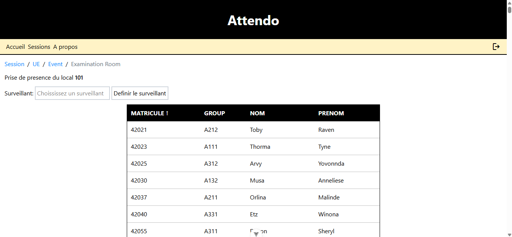
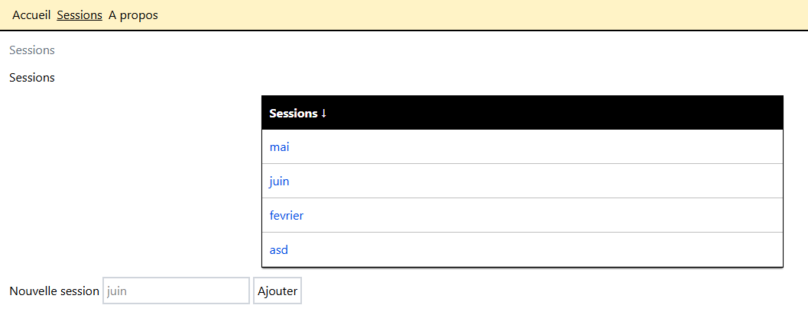
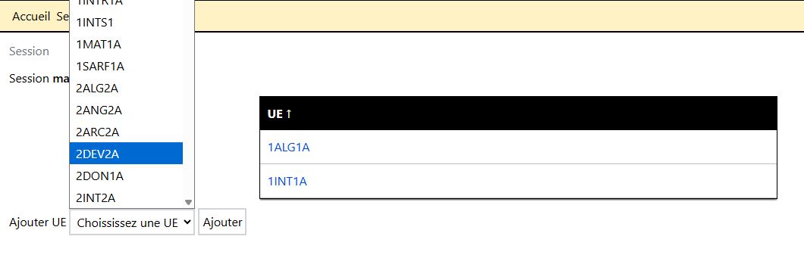
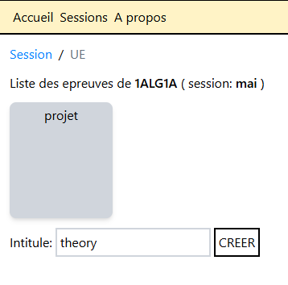
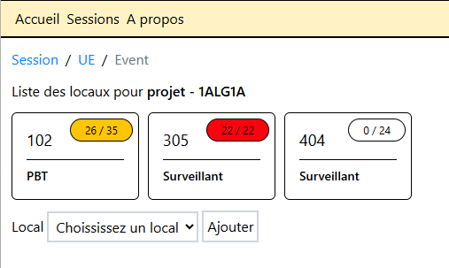
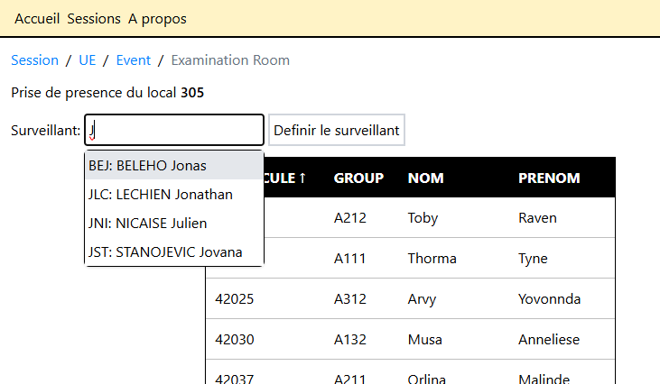
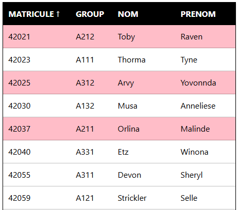

# Attendo
Attendo, a web app for managing exam sessions, UEs, exams, rooms with capacities, supervisors, and student enrollment in exams.

## Table of Contents
- [About](#about)
- [Screenshot](#screenshot)
- [Features](#features)
- [Tech Stack](#tech-stack)
- [Getting Started](#getting-started)
  - [Prerequisites](#prerequisites)
  - [Installation](#installation)
- [Usage / Examples](#usage--examples)
  - [Sessions & UEs](#sessions--ues)
  - [Exams & Rooms](#exams--rooms)
  - [Student Management](#student-management)

## About
Attendo is a web app to manage exam sessions, teaching units (UEs), exams, rooms, supervisors, and student enrollment through an interactive interface.

## Screenshot
<p align="center">
  
</p>
<p align="center">
    <em>Examination room view showing assigned supervisor and student attendance list</em>
</p>

## Features
- **Exam Session Management**
  - Create and organize multiple exam sessions (e.g., September, August).
  - Add teaching units (UEs) and associate exams with them.

- **Exam Setup**
  - Define exam types (e.g., Machine, Project, Theory).
  - Assign rooms to exams.
  - Appoint supervisors (teachers) to each exam room.

- **Student Management**
  - Add or remove students from an exam directly through the interactive table.
  - View student lists with matricule, group, and names.

- **Flexible Administration**
  - Modify existing sessions, UEs, exams, and assignments.
  - Track attendance and manage supervisors per room.

## Tech Stack
<p align="center">
  
  
  
  
  
  
</p>

## Getting Started

### Prerequisites
Make sure you have the following installed on your system:

- **Node.js** [Download here](https://nodejs.org/en)
- **npm** comes with Node.js
- **Git**

### Installation
- Clone the project: ```git clone https://github.com/souhaibelh/Attendo.git```
- Run: ```npm install```
- Run: ```npm run dev```
- Navigate to [http://localhost:5173/](http://localhost:5173/)

### Usage / Examples
- When you open the app, you will see a header with **three tabs**, Accueil, Sessions, A propos, the only ones accessible without logging in are Accueil and Sessions, there is also a button on the right side of the header allowing to log out, log in using google OAuth.

#### Sessions & UEs
- In the sessions header tab, you can create new **exam sessions** (e.g., *September*, *August*).  
- Inside a session, add **UEs** (teaching units).  
- For each UE, add one or more **exams** (e.g., *Machine*, *Project*).

<p align="center">
  <br/>
</p>
<p align="center">
  <em>Main sessions tab showing the list of sessions with input field to add new ones</em>
</p>  

<p align="center">
  <br/>
</p>
<p align="center">
  <em>Sessions view displaying UEs in a table with an input to add more from the list</em>
</p>  

<p align="center">
  <br/>
</p>
<p align="center">
  <em>Exams of a UE displayed as cards with an input field to create new exams</em>
</p>  


#### Exams & Rooms  
- Assign **rooms** to an exam
- Choose a **supervisor** (teacher) for the exam room.  
- Track attendance and manage students directly in the room’s table.  

<p align="center">
  <br/>
</p>
<p align="center">
  <em>Exam view showing multiple rooms with an input field to assign a new room from the list of locals</em>
</p>  

<p align="center">
  <br/>
</p>
<p align="center">
  <em>Room details page with supervisor selection via search box and the list of enrolled students</em>
</p>  


#### Student Management  
- Add or remove students from an exam by selecting them in the table.  
- View student details and sort by criteria such as **matricule**, **group**, **name**, and **surname**.  
- Update lists dynamically without leaving the exam page.  

<p align="center">
  <br/>
</p>
<p align="center">
  <em>Student table with non-enrolled students in white and enrolled students highlighted in pink</em>
</p>
